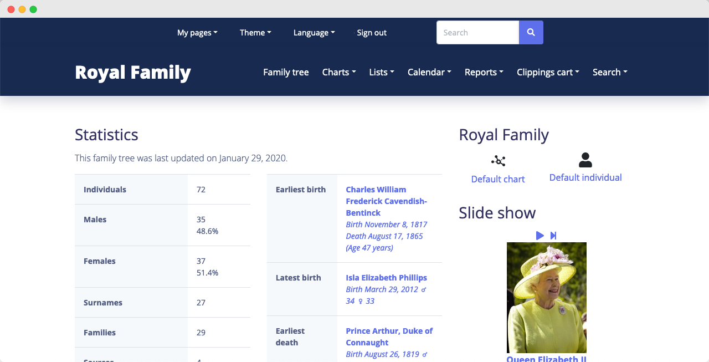
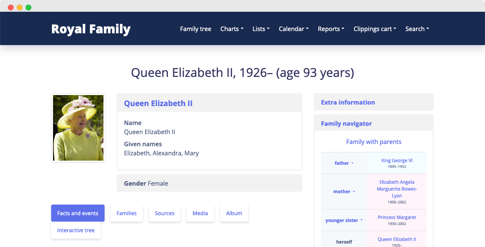
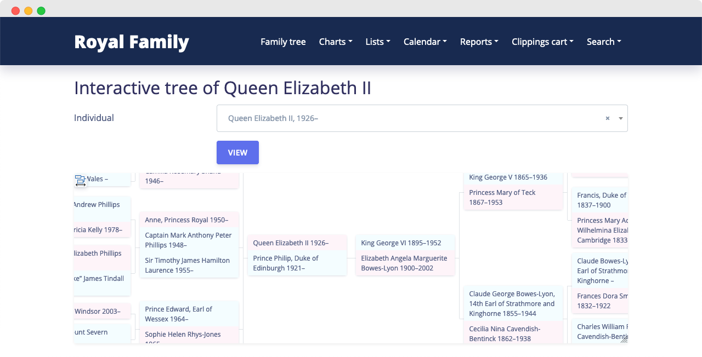

# Argon Theme for webtrees

A theme for the [webtrees](https://github.com/fisharebest/webtrees) online geneology application based on the [Argon Design System](https://github.com/creativetimofficial/argon-design-system). Since webtrees is templated with Bootstrap, this theme applies Argon styles in the majority of places but adapts where necessary.

## Screenshots

**Tree Home**

**Individual Page**

**Interactive Tree Chart**

## Compatibility

webtrees 2.0.12 (see [prior releases](https://github.com/jchue/argon-webtrees-theme/releases) for older versions)

## Installation

1. Download the .zip file of the [latest release](https://github.com/jchue/argon-webtrees-theme/releases/latest).
2. Unzip the package.
3. Ensure the folder is named `argon`.
4. Upload the folder into the `modules_v4` directory of the webtrees installation on your web server.
5. Ensure the theme is enabled in your Control panel.
